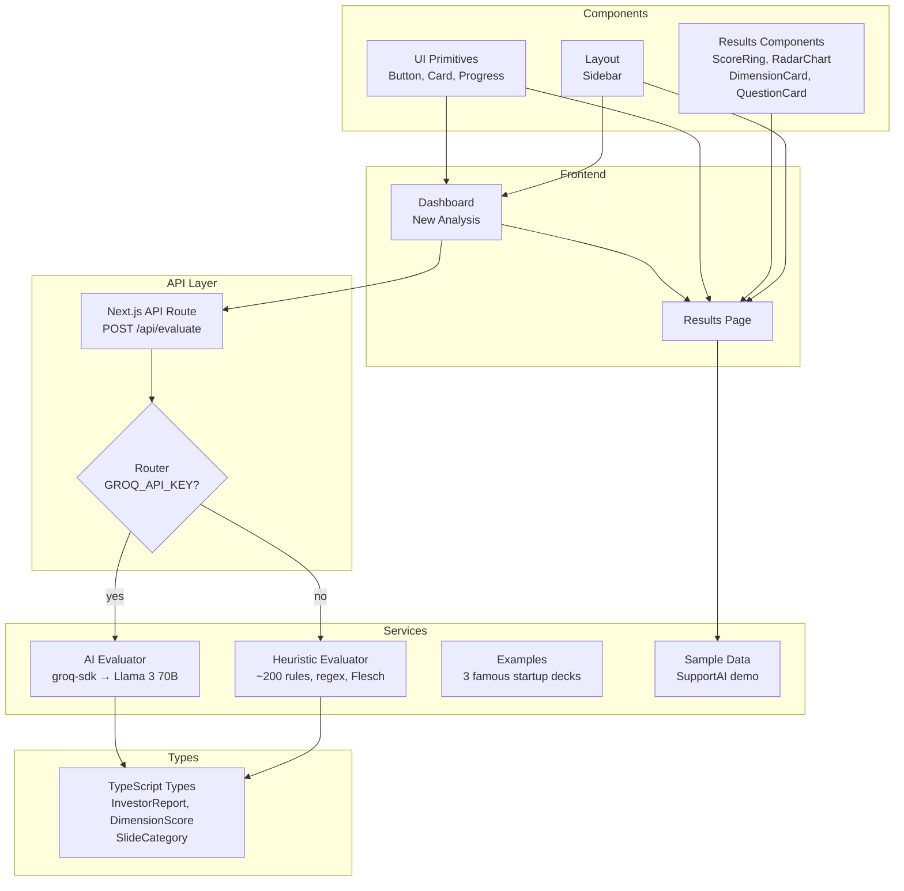
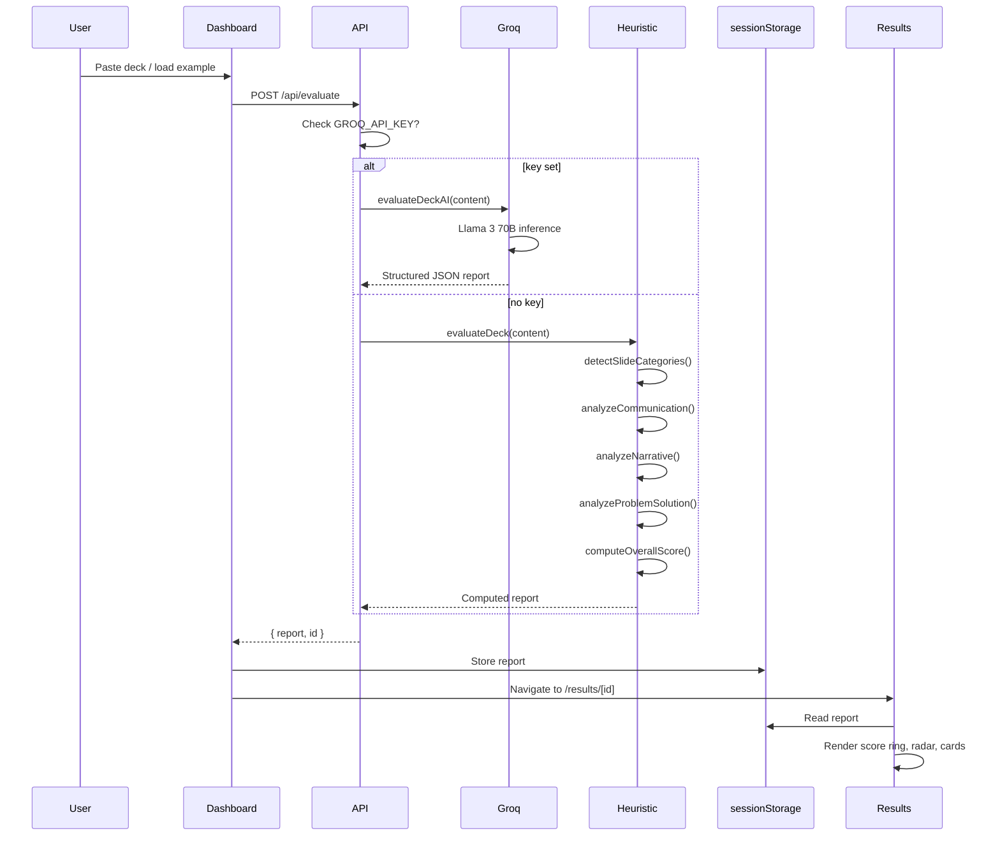
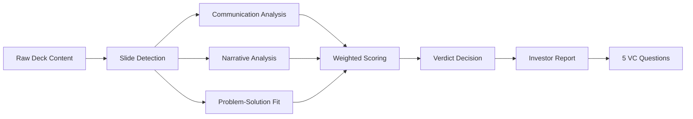

# Architecture Diagram

```mermaid
graph TB
    subgraph "Frontend"
        D[Dashboard<br/>New Analysis]
        R[Results Page]
    end

    subgraph "Components"
        UI[UI Primitives<br/>Button, Card, Progress]
        RES[Results Components<br/>ScoreRing, RadarChart<br/>DimensionCard, QuestionCard]
        LAY[Layout<br/>Sidebar]
    end

    subgraph "API Layer"
        API[Next.js API Route<br/>POST /api/evaluate]
        ROUTER{Router<br/>GROQ_API_KEY?}
    end

    subgraph "Services"
        AIEV[AI Evaluator<br/>groq-sdk → Llama 3 70B]
        HEV[Heuristic Evaluator<br/>~200 rules, regex, Flesch]
        EX[Examples<br/>3 famous startup decks]
        SD[Sample Data<br/>SupportAI demo]
    end

    subgraph "Types"
        T[TypeScript Types<br/>InvestorReport, DimensionScore<br/>SlideCategory]
    end

    D --> API
    API --> ROUTER
    ROUTER -->|yes| AIEV
    ROUTER -->|no| HEV
    AIEV --> T
    HEV --> T
    D --> R
    R --> SD
    UI --> D
    UI --> R
    RES --> R
    LAY --> D
    LAY --> R
```

## Data Flow

```mermaid
sequenceDiagram
    User->>Dashboard: Paste deck / load example
    Dashboard->>API: POST /api/evaluate
    API->>API: Check GROQ_API_KEY?
    alt key set
        API->>Groq: evaluateDeckAI(content)
        Groq->>Groq: Llama 3 70B inference
        Groq-->>API: Structured JSON report
    else no key
        API->>Heuristic: evaluateDeck(content)
        Heuristic->>Heuristic: detectSlideCategories()
        Heuristic->>Heuristic: analyzeCommunication()
        Heuristic->>Heuristic: analyzeNarrative()
        Heuristic->>Heuristic: analyzeProblemSolution()
        Heuristic->>Heuristic: computeOverallScore()
        Heuristic-->>API: Computed report
    end
    API-->>Dashboard: { report, id }
    Dashboard->>sessionStorage: Store report
    Dashboard->>Results: Navigate to /results/[id]
    Results->>sessionStorage: Read report
    Results->>Results: Render score ring, radar, cards
```

## Evaluation Pipeline

```mermaid
flowchart LR
    A[Raw Deck Content] --> B[Slide Detection]
    B --> C1[Communication Analysis]
    B --> C2[Narrative Analysis]
    B --> C3[Problem-Solution Fit]
    C1 --> D[Weighted Scoring]
    C2 --> D
    C3 --> D
    D --> E[Verdict Decision]
    E --> F[Investor Report]
    F --> G[5 VC Questions]
```
